# Praat_Scripts 

[](https://github.com/RichardLitt/standard-readme)

该项目包括一些`Praat`常用脚本，并结合简单实例说明如何使用这些脚本，每一个独立的目录里面有示例文件以及结果文件，适用于已经对`Praat`基本操作有些了解，对`时长`，`基频`，`共振峰`等基本声学参数有所了解的初学者。  

该项目包括以下内容：

1. `Praat`基本操作；
2. `Praat`对文件，包括标注文件、音频文件的操作；
3. `Praat`对具体的标注信息的操作，比如`tier`, `interval`修改，增加，删除等操作；
4. 使用`Praat`提取主要的声学参数，`时长`，`基频`，`共振峰`；

希望能够对想通过`Praat`入门实验语音学的初学者有所帮助，更多实用的`Praat`脚本仍然更新中。  

## 目录  

* [背景](#背景)
* [安装](#安装)
* [Praat基本操作](#Praat基本操作)
    * [打开保存](#打开保存)
    * [脚本运行](#脚本运行)
* [Praat常用脚本](#常用操作)
    * [01-重采样音频文件](#01-重采样音频文件)
    * [02-获取目录内文件名](#02-获取目录内文件名)
    * [03-长音频文件切分](#03-长音频文件切分)
    * [04-替换标注内容](#04-替换标注内容)
    * [05-标注文件增加多层](#05-标注文件增加多层)
    * [06-标注文件修改某层](#06-标注文件修改某层)
    * [07-计算目录里音频总时长](#07-计算目录里音频总时长)
    * [08-提取某一层的时长](#08-提取某一层的时长)
    * [09-提取时长和基频](#09-提取时长和基频)
    * [10-提取时长和共振峰](#10-提取时长和共振峰)
    * [11-画元音分布图](#11-画元音分布图)
    * [12-画平行句语调图](#12-画平行句语调图)
 

## 背景  

##### 命名  
>`Praat`在荷兰语中是说话或交谈的意思，而`doing phonetics by computer`即使用计算机研究语音学。作为软件的名称，简便起见，合起来翻译作`Praat`语音学软件。  

##### 作者  
>`Praat`的作者是荷兰阿姆斯特丹大学人文学院语音科学研究所的主席保罗·博尔斯马（*Paul Boersma*）教授和大卫·威宁克（*David Weenink*）助教授。  

##### 版本  
>`Praat`最早的版本发布于1993年。起初用户还无法自由地下载使用，但从2003年6月5日的4.1版起，作者取消了专门的授权并开放了绝大部分源代码。进一步，从2004年3月4日的4.2版起，作者开放了全部源代码，使`Praat`成为采用GNU通用公共许可证授权的开源软件。相隔短则一天，长则月余，作者就会发布最近修订的版本，消除旧的故障，增添新的功能。2007年12月10日发布了5.0版。  
>`Praat`目前支持在多种计算机平台上运行，包括：  
>* 作者为以上平台的用户提供已编译好的目标文件。高级用户还可以在其他操作系统平台上修改并编译源代码后运行`Praat`程序。
>* `Praat`能够在图形和命令行两种用户界面下运行，但两种界面的目标文件（可执行文件）各自独立，以`Windows`版为例，即分为`praat.exe`和`praatcon.exe`两个可执行文件，其中后者只能通过命令行方式从控制台调用。

该部分信息来源于[百度百科-Praat](https://baike.baidu.com/item/praat/7852897?fr=aladdin)。

## 安装  
`Praat`官方网站[http://www.fon.hum.uva.nl/praat/](http://www.fon.hum.uva.nl/praat/)，请根据自己的系统下载`Windows`, `Mac`, 或者`Linux`等版本，下载到本地电脑之后，双击打开**Praat.exe**就可以使用，无需安装。另外为了更好的体验`IPA`等特殊符号的标注，需要将安装页面的**Phonetic and international symbols**也一并安装，具体方法网站都有详细说明。请尽量使用最新版本。官方网站也提供了英文版的使用说明，以及很多的脚本，由于每个人完成实验的设计，目的等都不相同，所以很多脚本需要对`Praat`脚本语法比较熟悉才能灵活使用。  

## Praat基本操作

#### 打开保存
1.  打开软件，双击已经下载的`Praat.exe`  
<div align=center>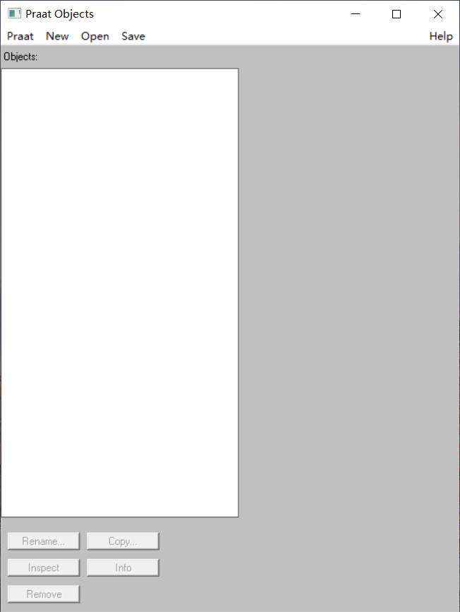</div>

2. 点击`Open`, `Read from file...`，从弹出的对话框里找到要打开的标注文件(.TextGrid)或者音频文件(.wav)，再选择打开，这里可以选择多个文件同时打开
<div align=center>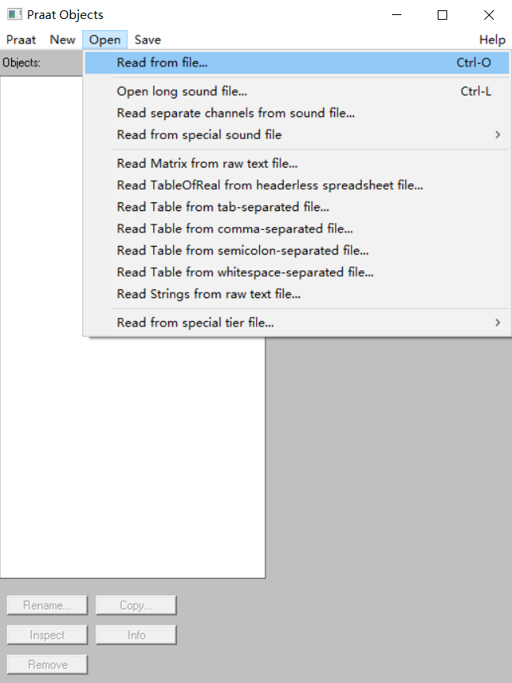</div>

3. 在没有标注文件的时候，可以选择打开的音频文件，选择右侧的`Annotate`， `To TextGrid...`， 可以创建新的标注文件
<div align=center>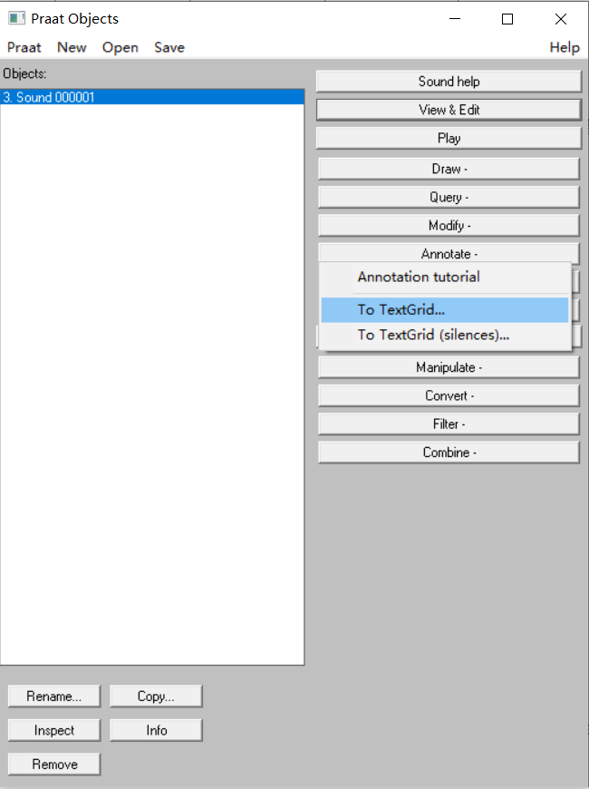</div>

4. 如图所示，我们创建两层，一层是`word`层，一层是`phoneme`层，此处命名可自定义
<div align=center>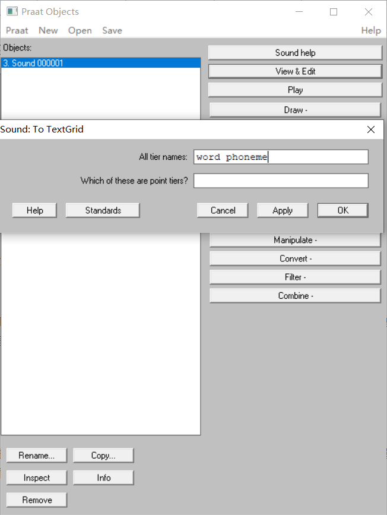</div>

5. 这时，主窗口就会有一对同样名字的文件，一个是音频文件`Sound`，一个是标注文件`TextGrid`，同时选中这两个文件，再点右侧的`View & Edit`，这时会打开标注窗口，音频文件在上方，会显示声波图和频谱图，下方是标注区域，即是新建的`TextGrid`文件，并有两层`Word`和`Phoneme`层，先用鼠标找到合成的声音边界位置，再用鼠标点击如图位置的**小圆点**，则会增加一个**边界**，两个边界之间可以填写标注内容，如图前三个汉字部分
<div align=center>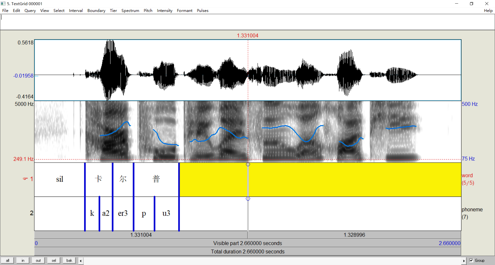</div>

<div align=center><sup>注: 示例所使用数据为[标贝开源女声数据](https://www.data-baker.com/open_source.html)</sup></div>

6. 每一句标注完成之后，回到主窗口，这时的标注文件并未自动保存，需要点击`Save`, `Save as text file...`，保存到相应的位置
<div align=center>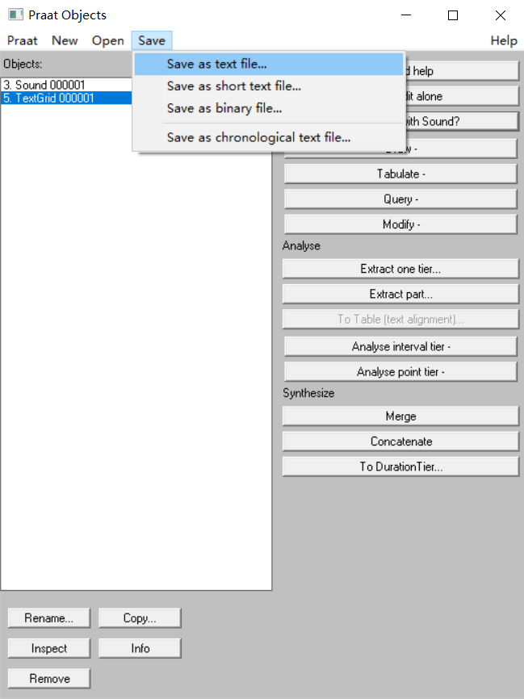</div>

7. 标注文件可以采用重复以上步骤二次打开，再次修改等操作，其它详细的操作，都可以参考社科院熊子瑜老师的《Praat语音软件使用手册》

#### 脚本运行

在掌握了`Praat`的基本操作之后，要知道如何运行一个脚本。  

1. 先打开`Praat`软件
<div align=center></div>

2. 点击`Praat`, `Open praat script...`，
<div align=center>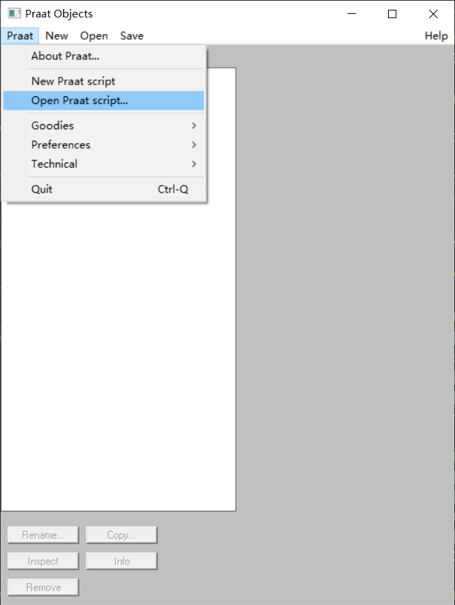</div>

3. 找到需要打开的脚本，这里用简单的例子，[`00-test\test.Praat`](00-test\test.Praat)，这个脚本只有一句话，是在屏幕上打印`Hello World!`
<div align=center>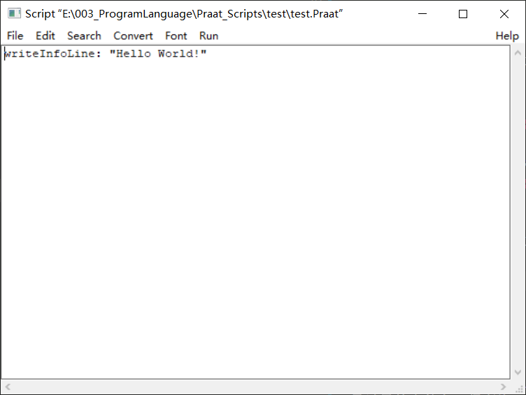</div>

4. 点击这个窗口的`Run`, `Run`
<div align=center>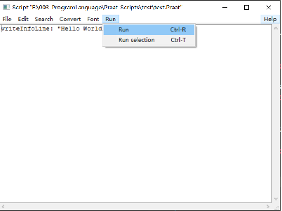</div>

5. 脚本运行的结果是显示一句话，`Hello World!`，代表脚本运行成功
<div align=center>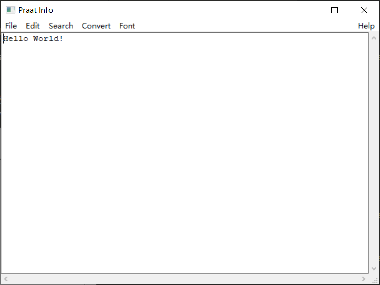</div>

## Praat常用脚本  

##### 01-重采样音频文件  
* 脚本: [`01-resample_sound_files\Resample_Sound_Files.Praat`](01-resample_sound_files/Resample_Sound_Files.Praat) 
* 描述: 对给定目录里的音频，重新采样。
* 第一个选项可以设置音频的格式，默认为`.wav`；
* 第二个选项是原始的输入音频文件所在的目录，比如这里设置为`wavs_48k`目录，请修改为自己电脑相应的目录；
* 第三个选项是重采样之后的音频所在的目录，比如这里设置的是`wavs_16k`，请修改为自己电脑相应的目录；
* 第四个选项是重采样率，这里设置为`16000`，其它选项可以有`44100, 24000, 22050, 8000`等；
* 第五个选项是采样精度，这里无需改动；
* 设置完成，点击`Run`运行脚本，结果文件在`wavs_16k`中；
```
form ReSample sound files
   sentence Sound_file_extension .wav
   comment Directory path of input files:
   text input_directory  E:\003_ProgramLanguage\Praat_Scripts\01-resample_sound_files\wavs_48k\
   comment Directory path of resampled files (old files will be overwritten!):
   text output_directory  E:\003_ProgramLanguage\Praat_Scripts\01-resample_sound_files\wavs_16k\
   positive New_sample_rate_(Hz) 16000
   positive Precision_(samples) 50
   comment (See the Praat manual for details on resampling.)
endform
```
<div align=left><sup>注: 可以直接在脚本里直接修改相应的目录，参数再Run，也可以先Run之后输入</sup></div>

##### 02-获取目录内文件名
* 脚本: [`02-get_file_names\Get_FileNames_of_One_Directory.Praat`](02-get_file_names\Get_FileNames_of_One_Directory.Praat)
* 描述: 提取一个目录里所有文件名，并保存，代码简单，只是为了让初学者更熟悉脚本。
* 第一个选项可以设置要提取的目录里的文件扩展名，默认为`.wav`；
* 第二个选项是设置输入目录`01-resample_sound_files\wavs_48k`；
* 第三个选项是要保存的文件名结果文件`02-get_file_names\file_names_wavs_48k.txt`。  
>第一个例子是提取`01-resample_sound_files/wavs_48k`里的文件名。 
```
form Information
   sentence file_extension .wav
   comment Directory path of input files:
   text input_directory E:\003_ProgramLanguage\Praat_Scripts\01-resample_sound_files\wavs_48k\
   comment Result path:
   text result_path E:\003_ProgramLanguage\Praat_Scripts\02-get_file_names\file_names_wavs_48k.txt
endform
```
>第二个例子是提取`images`目录里的文件名，注意这里修改扩展名为`.png`。
```
form Information
   sentence file_extension .png
   comment Directory path of input files:
   text input_directory E:\003_ProgramLanguage\Praat_Scripts\images\
   comment Result path:
   text result_path E:\003_ProgramLanguage\Praat_Scripts\02-get_file_names\file_names_images.txt
endform
```

##### 03-长音频文件切分
* 脚本: [`03-long_sound_splits\Split_Long_Sound_Files.Praat`](03-long_sound_splits\Split_Long_Sound_Files.Praat)
* 描述: 将长文件切分成小文件；适用于录音条件限制，只能保存到一个文件里，在做处理的时候，通过这个脚本可以辅助快速的将长文件切分成一个个的小文件，便于检索和标注。 
* 首先，要把长的音频文件，在`Praat`里手工标出需要切分的小句，如下例将需要切的部分标出边界，图示的`s`符号自定义，如图空白的部分则不会被切分出来，也可以用具体的语音内容；
* 第二个例子手工标出了具体的语音内容，保存的时候也会将这个内容提取出来保存；
>第一个例子，需要对长音频文件手工做如下标注：
<div align=center>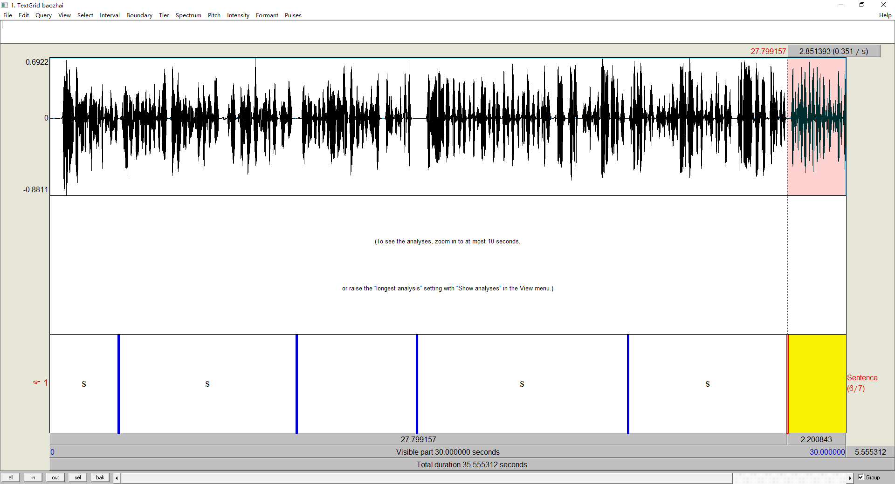</div> 

>第二个例子，需要对长音频文件手工做如下标注：
<div align=center>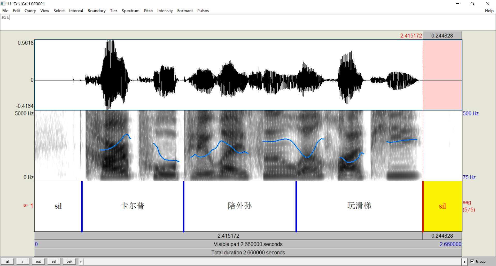</div> 

>第一个例子：切出来的小句子按序号排列。输入要切分的长文件和标注所在的目录**LongWavToDo_1**，输入切分出来的文件所在的目录**small_wavs_1**，输入标注的符号所在的层，一般只有**1**层，这里因为只保存标出来**s**的位置，所以这个**mark_string**设置为**s**，保存的文件名选项**file_mark**设置为**2**，即用原来的文件名带上新的序号，最后的**4**表示序号是几位，这里**4位**表示为**0001**这样子。
```
form dialogue
	comment Please input the source wav and textgrid files:
	text input_directory E:\003_ProgramLanguage\Praat_Scripts\03-long_sound_splits\LongWavToDo_1\
	comment Please input the result wav files:
	text output_directory E:\003_ProgramLanguage\Praat_Scripts\03-long_sound_splits\small_wavs_1\
	comment Please input the mark symbols tier:
	positive tier_number 1
	sentence mark_string s
	optionmenu file_mark: 2
		option FileName_markString_order
		option FileName_order
	comment Please input the digits of order：
	positive limit 4
endform
```
运行之后，查看`small_wavs_1`目录，可以看到切分出来的文件是这样的，每个文件`baizhai`是源文件名，后面的`1，2，3，4`就是需要切分出来的标`s`的部分，共`4`部分
```
baozhai_0001.wav
baozhai_0002.wav
baozhai_0003.wav
baozhai_0004.wav
```

另外注意，在切分的时候，相对边界在代码里有设置是切分边界前，后各延长`0.3`秒，用户可自定义设置这个长度
```Javascript
##### extend 0.3 seconds at the begin and end boundary
start = start - 0.3
end = end + 0.3
```

>第二个例子：切出来的小句子文件名里保存相应的内容。输入要切分的长文件和标注所在的目录**LongWavToDo_2**，输入切分出来的文件所在的目录**small_wavs_2**，输入标注的符号所在的层，一般只有**1**层，这里只保存标具体内容的位置，所以这个**mark_string**设置为**空**，保存的文件名选项**file_mark**设置为**1**，即用原来的文件名带上内容再带上新的序号，最后的**4**表示序号是几位，这里**4位**表示为**0001**这样子。
```Javascript
form dialogue
	comment Please input the source wav and textgrid files:
	text input_directory E:\003_ProgramLanguage\Praat_Scripts\03-long_sound_splits\LongWavToDo_2\
	comment Please input the result wav files:
	text output_directory E:\003_ProgramLanguage\Praat_Scripts\03-long_sound_splits\small_wavs_2\
	comment Please input the mark symbols tier:
	positive tier_number 1
	sentence mark_string 
	optionmenu file_mark: 1
		option FileName_markString_order
		option FileName_order
	comment Please input the digits of order：
	positive limit 4
endform
```
运行之后，查看`small_wavs_2`目录，可以看到切分出来的文件是这样的，每个文件`000001`是源文件名，后面的已经保存了相应的内容共`3`句话，最后带上了序号`1，2，3`
```
000001_卡尔普_0001.wav
000001_陪外孙_0002.wav
000001_玩滑梯_0003.wav
```

另外注意，在切分的时候，相对边界在代码里有设置是切分边界前，后各延长`0.3`秒，用户可自定义设置这个长度
```Javascript
##### extend 0.3 seconds at the begin and end boundary
start = start - 0.3
end = end + 0.3
```

##### 04-替换标注内容
* 脚本: [`04-replace_labels\Replace_Intervals.praat`](04-replace_labels\Replace_Intervals.praat)
* 描述: 替换标注内容，首先建立一个替换列表，将所有列表里的映射全部替换，输入原标注文件所在的目录**old_TextGrid**，再输入替换列表所在的文件路径，**replace_list.txt**，这个文件的格式是，第一行是表头，第一列是原来的标注内容，第二列是要替换的内容：
```
old	new
sil	##
sp1	sp
```
* 第三个选项`reference_tier`表示要替换第几层，这里是替换第`1`层；
* 最后是输入替换后的文件保存路径`new_TextGrid`；
* 另外最后在这个目录下会生成一个`log.txt`，这里面记录了被替换的所有信息；
```
form Information
	comment Directory path of input files:
	text input_directory E:\003_ProgramLanguage\Praat_Scripts\04-replace_labels\old_TextGrid\
    comment Path of map list file:
	text list_path E:\003_ProgramLanguage\Praat_Scripts\04-replace_labels\replace_list.txt
	comment Target Tier:
	positive reference_tier 1
	comment Path of output result file:
	text save_path E:\003_ProgramLanguage\Praat_Scripts\04-replace_labels\new_TextGrid\
endform
```

##### 05-标注文件增加多层
* 脚本: [`05-add_some_tiers\add_tiers.Praat`](05-add_some_tiers\add_tiers.Praat)
* 描述: 可以增加很多层，以及指定增加的层类型是`interval`还是`point`：
* 指定包括原始`TextGrid`的输入目录`input_directory`  
* 指定需要保存`TextGrid`的输出目录`output_directory`  
* 关于增加选项`add_option`的一些例子说明
    * `add_option: hello good morning`表示在原来`TextGrid`的最底部分别增加名称为`hello, good, morning`的三个层；
    * `add_option: hello good| morning`表示在原来`TextGrid`的最底部分别增加名称为`hello, good, morning`的三个层, 请注意`good`后面的`|`，表示这个层需要增加`point`层；
    * `add_option: 2(hello) good 1(morning|)`表示在原来`TextGrid`的第`2`层的位置增加名称为`hello`的`interval`层，在最底部增加名称为`good`的层, 在第`1`层的位置增加名称为`morning`的`point`层；

```
form dialogue
	sentence input_directory E:\003_ProgramLanguage\Praat_Scripts\05-add_some_tiers\old_TextGrid\
	sentence output_directory E:\003_ProgramLanguage\Praat_Scripts\05-add_some_tiers\new_TextGrid\
	sentence add_option hello good morning|
endform
```

##### 06-标注文件修改某层
* 脚本: [`06-modify_one_tier\add_remove_duplicate_set_tier.Praat`](06-modify_one_tier\add_remove_duplicate_set_tier.Praat)
* 描述: 该脚本可以一次进行增加，删除，复制，修改层名称这四个操作，但是每一种操作一次只进行一层：
* 指定包括原始`TextGrid`的输入目录`input_directory`  
* 指定需要保存`TextGrid`的输出目录`output_directory`  
* 需要增加层，选中`add_option`，以及选择`interval`或者`point`，其它选项参考`Praat`增加层的操作
* 需要删除层，选中`remove_option`, 只需提供删除第几层即可
* 需要复制层，选中`copy_option`，具体操作参考`Praat`复制层的操作
* 需要修改层的名称，选中`set_option`，具体操作参考`Praat`设置层名称的操作

```
form dialogue
	sentence input_directory E:\003_ProgramLanguage\Praat_Scripts\06-modify_one_tier\old_TextGrid\
	sentence output_directory E:\003_ProgramLanguage\Praat_Scripts\06-modify_one_tier\new_TextGrid\
	comment Do you want to add tier:
	boolean add_option 1
	choice select_type: 1
		option 1. interval tier
		option 2. point tier
	integer add_position 1
	sentence add_tier_name hello
	comment Do you want to remove tier:
	boolean remove_option 0
	integer remove_tier_num 1
	comment Do you want to duplicate tier:
	boolean copy_option 0
	integer tiernum 1
	integer position 2
	sentence target_tier_name nice
	comment Do you want to set tier names:
	boolean set_option 0
	integer tiernum 1
	sentence set_tier_name good
endform
```

##### 07-计算目录里音频总时长
* 脚本: [`07-compute_total_duration\Get_Duration_From_Sound_Files.praat`](07-compute_total_duration\Get_Duration_From_Sound_Files.praat)
* 描述: 该脚本计算给定目录里所有音频文件的总时长，可用于统计录音的数据，给出的结果既包括每个文件的时长，也包括最后的总时长。
* 这里的输入目录是`01`例子中的`wavs`目录`01-resample_sound_files\wavs_48k`
* 结果文件在`07-compute_total_duration\duration_result.txt`，结果文件格式为如下，总时长单位也是`秒`：
```
000001.wav,2.66
000002.wav,2.86
Total: 5.52
```

```
form dialogue
	comment Directory path of input files:
	sentence input_directory E:\003_ProgramLanguage\Praat_Scripts\01-resample_sound_files\wavs_48k\
	comment Path of output result file:
	sentence save_result E:\003_ProgramLanguage\Praat_Scripts\07-compute_total_duration\duration_result.txt
endform
```

##### 08-提取某一层的时长
* 脚本: [`08-get_duration_of_one_tier\Get_Duration_of_One_Tier.praat`](08-get_duration_of_one_tier\Get_Duration_of_One_Tier.praat)
* 描述: 该脚本提取标注里给定某层的所有`interval`的时长统计，假定我们有如下的标注文件，利用这个脚本可以提取第`1`层或者第`2`层的内容及对应的时长:  
<div align=center>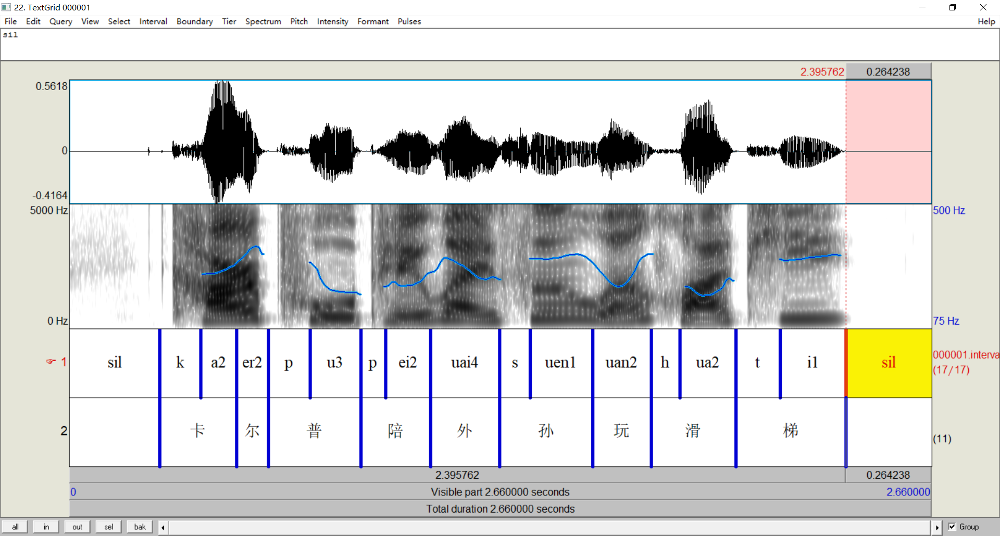</div>

* 这里的输入目录是`08-get_duration_of_one_tier\input_data`
* `reference_tier`为`1`表示提取第`1`层，同理可以提取第`2`层
```
form Information
	comment Directory path of input files:
	text input_directory E:\003_ProgramLanguage\Praat_Scripts\08-get_duration_of_one_tier\input_data\
	comment Target Tier:
	positive reference_tier 1
	comment Path of output result file:
	text save_result E:\003_ProgramLanguage\Praat_Scripts\08-get_duration_of_one_tier\result_duration_tier_1.txt
endform
```
* 结果文件在`08-get_duration_of_one_tier\result_duration_tier_1.txt`，结果文件格式为如下，单位是`秒`：
```
fileName,IntervalName,duration
000001.TextGrid,sil,0.27958612055419324
000001.TextGrid,k,0.12670506851255176
000001.TextGrid,a2,0.11022310838083771
000001.TextGrid,er2,0.09786163828205219
000001.TextGrid,p,0.1287653135290161
......
```

将`reference_tier`改为`2`之后，结果文件`08-get_duration_of_one_tier\result_duration_tier_2.txt`如下：
```
fileName,IntervalName,duration
000001.TextGrid,卡,0.23692817689338946
000001.TextGrid,尔,0.09786163828205219
000001.TextGrid,普,0.2853439347802995
000001.TextGrid,陪,0.21528012949006559
000001.TextGrid,外,0.21235920455136426
000001.TextGrid,孙,0.2863740572885316
......
```

##### 09-提取时长和基频
* 脚本: [`09-get_duration_and_pitch\Get_Duration_and_Pitch.Praat`](09-get_duration_and_pitch\Get_Duration_and_Pitch.Praat)
* 描述: 该脚本提取标注里音素层(基频在浊音段比较稳定)的所有`interval`的时长和基频，基频为通过音频文件自动生成`Pitch`文件，并根据音素边界平均归一化`10个点`，提取这`10个点`的值:  

* 第一个参数`input_wav_directory`，设置输入的`wav`目录`09-get_duration_and_pitch\input_wav`
* 第二个参数`input_directory`，设置输入的`TextGrid`目录`09-get_duration_and_pitch\input_TextGrid`
* 当前实例音素层为`第1层`，`reference_tier`设置为`1`
* 结果文件`save_result`，设置为`09-get_duration_and_pitch\result_duration_pitch.txt`
```
form Information
	comment Directory path of input wav files:
	text input_wav_directory E:\003_ProgramLanguage\Praat_Scripts\09-get_duration_and_pitch\input_wav\
	comment Directory path of input TextGrid files:
	text input_directory E:\003_ProgramLanguage\Praat_Scripts\09-get_duration_and_pitch\input_TextGrid\
	comment Target Tier:
	positive reference_tier 1
	comment Path of output result file:
	text save_result E:\003_ProgramLanguage\Praat_Scripts\09-get_duration_and_pitch\result_duration_pitch.txt
endform
```
* 设置完成后，点击`Run`，运行脚本可以得到结果结果文件，请注意可以通过拷贝在**Excel表**里排序的方式，<font color="red">删除非元音部分</font>：
>fileName	name	duration	Pitch1	Pitch2	Pitch3	Pitch4	Pitch5	Pitch6	Pitch7	Pitch8	Pitch9	Pitch10
>000001.TextGrid	sil	0.280	262	262	262	262	262	262	262	262	262	262
>000001.TextGrid	k	0.127	262	262	262	262	262	262	262	262	262	262
>000001.TextGrid	a2	0.110	262	262	263	265	268	273	278	285	293	303
>000001.TextGrid	er2	0.098	303	313	322	331	338	341	341	338	333	328
>000001.TextGrid	p	0.129	328	324	320	318	315	312	310	306	300	291
>000001.TextGrid	u3	0.157	291	271	247	225	211	204	200	199	198	199

* **扩展实例：利用这个结果画中文普通话的声调图**这句话选自标贝开源数据集，中文内容是`卡尔普陪外孙玩滑梯`，这9个汉字，包括5个2声调，2个1声调，1个3声调，1个4声调，我们将结果数据拷贝到Excel里，`删除非韵母部分`(理论上韵母是主要的声调携带部分)，将多个声调的取平均，这样得到`4个声调的各10个Pitch点的值`，将这10个值在Excel里画一个`带数据标记的拆线图`，则可以得到比较形象的普通话四个声调描述图，由于这里数据量较少，而且是在语流中，四个声调的表现并不象我们常规在教科书里那样，如果学习者有兴趣将数据量增加，该描述图将会越来越准确，参考`09-get_duration_and_pitch\中文声调图.xlsx`
<div align=center>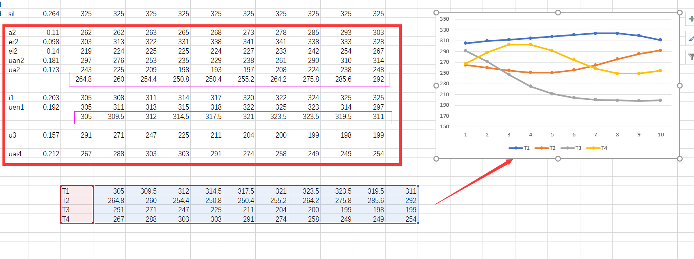</div>

##### 10-提取时长和共振峰
* 脚本: [`10-get_duration_and_formant\Get_Duration_and_Formant.Praat`](10-get_duration_and_formant\Get_Duration_and_Formant.Praat)
* 描述: 该脚本提取标注里音素层的所有`interval`的时长和共振峰，并根据音素边界提取平均值，只提取第1，第2，第3共振峰，即`F1, F2, F3`:  

* 第一个参数`input_wav_directory`，设置输入的`wav`目录`10-get_duration_and_formant\input_wav`
* 第二个参数`input_directory`，设置输入的`TextGrid`目录`10-get_duration_and_formant\input_TextGrid`
* 当前实例音素层为第`1`层，`reference_tier`设置为`1`
* 结果文件`save_result`，设置为`10-get_duration_and_formant\result_duration_formant.txt`
```
form Information
	comment Directory path of input wav files:
	text input_wav_directory E:\003_ProgramLanguage\Praat_Scripts\10-get_duration_and_formant\input_wav\
	comment Directory path of input TextGrid files:
	text input_directory E:\003_ProgramLanguage\Praat_Scripts\10-get_duration_and_formant\input_TextGrid\
	comment Target Tier:
	positive reference_tier 1
	comment Path of output result file:
	text save_result E:\003_ProgramLanguage\Praat_Scripts\10-get_duration_and_formant\result_duration_formant.txt
endform
```
* 设置完成后，点击`Run`，运行脚本可以得到结果结果文件，请注意可以通过拷贝在**Excel表**里排序的方式，<font color="red">删除非元音部分</font>：
```
fileName	name	duration	F1	F2	F3
000001.TextGrid	sil	0.280	1058	2317	3145
000001.TextGrid	k	0.127	1202	2000	2792
000001.TextGrid	a2	0.110	998	1587	2535
000001.TextGrid	er2	0.098	620	1607	2334
000001.TextGrid	p	0.129	914	1850	2902
000001.TextGrid	u3	0.157	413	984	3334
000001.TextGrid	p	0.075	756	1953	2924
000001.TextGrid	ei2	0.140	491	2140	3096
000001.TextGrid	uai4	0.212	622	1905	3285
000001.TextGrid	s	0.095	1004	2089	3029
```
* 如果有需要提取`第4，第5`等共振峰，可修改脚本以下位置：
```
formant1 = Get mean: 1, sTime, eTime, "hertz"
output$ = output$ + fixed$(formant1, 0) + tab$
formant2 = Get mean: 2, sTime, eTime, "hertz"
output$ = output$ + fixed$(formant2, 0) + tab$
formant3 = Get mean: 3, sTime, eTime, "hertz"
output$ = output$ + fixed$(formant3, 0)
```  

##### 11-画元音分布图
* 脚本: [`11-draw_vowel_map\Draw_Vowel_Map.Praat`](11-draw_vowel_map\Draw_Vowel_Map.Praat)
* 描述: 根据提取的大量共振峰数据，画出`F1, F2`的声学元音分布图，即把`F1和F2`分别作为坐标图里的`x轴，y轴`:   
* 需要准备好输入的文件，格式如下，第一行为表头，第一列是元音名称，第二，三列分别是第一，二共振峰
```
label	F1	F2
u	320	630
a	780	1300
o	500	940
\as	720	1060
\o/	430	1580
i	280	2300
y	320	1680
e	420	2000
\yc	420	1540
...
```
* 注意元音名称，有一些转化符号，这部分符号的表示可以参考`Praat`的`Phonetic symbols`说明
<div align=center>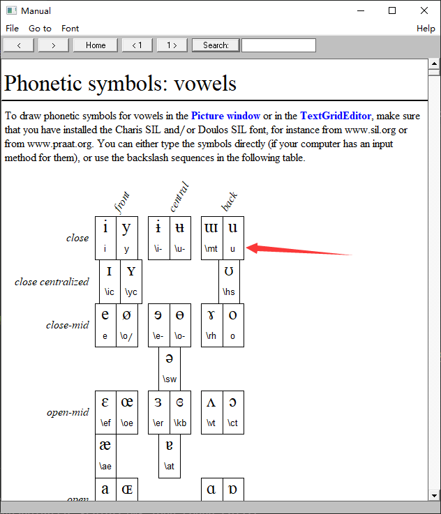</div>

* 设置完成后，点击`Run`，在`Praat`的`Picture`窗口会生成结果分布图，这个图可以在`Picture`点击`Edit，Copy to clipboard`再拷贝到其它地方使用
<div align=center>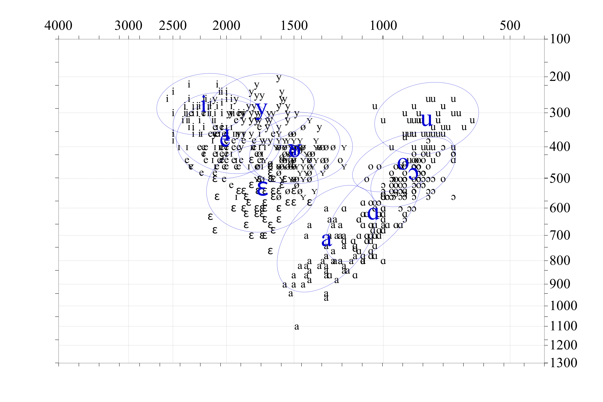</div>

##### 12-画平行句语调图
* 脚本: [`12-intonation_pattern\Get_Duration_and_Pitch_Sentence.Praat`](12-intonation_pattern\Get_Duration_and_Pitch_Sentence.Praat)
* 描述: 这个脚本是[09-提取时长和基频](#09-提取时长和基频)的一个变化，`09`中提取的基频是一个音节一行，而这里需要对多个同样内容的句子，提取的基频序列，画出对比的语调图，所以每一句提取的所有基频需要在同一行，适用的情况如下，给定例子目录里有5句话，是`5个人`的语音，是同样的内容`She is much too busy!`，语料来源于[http://www.phon.ox.ac.uk/files/apps/IViE/](http://www.phon.ox.ac.uk/files/apps/IViE/)，该网站有一个很多人读的`Cinderella的语料`，由很多不同英国方言的人语音组成。这些句子都被标注了音素边界，如下图是两句话的示例。  
<div align=center>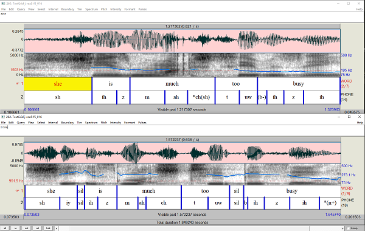</div>

* 先设置输入`wavs`的目录`12-intonation_pattern\input_data`
* 设置输入`TextGrid`的目录`12-intonation_pattern\input_data`
* 提取层`reference_tier`是音素层所在的层数是`2`
* 结果文件所在的路径`12-intonation_pattern\result_duration_pitch.txt`
```
form Information
	comment Directory path of input wav files:
	text input_wav_directory E:\003_ProgramLanguage\Praat_Scripts\12-intonation_pattern\input_data\
	comment Directory path of input TextGrid files:
	text input_directory E:\003_ProgramLanguage\Praat_Scripts\12-intonation_pattern\input_data\
	comment Target Tier:
	positive reference_tier 2
	comment Path of output result file:
	text save_result E:\003_ProgramLanguage\Praat_Scripts\12-intonation_pattern\result_duration_pitch.txt
endform
```
* 设置完成后，点击`Run`，运行脚本可以得到结果文件，这里的一句话所有结果是在一行内的
```
fileName	name	duration	Pitch1	Pitch2	Pitch3	Pitch4	Pitch5	Pitch6	Pitch7	Pitch8	Pitch9	Pitch10
j-rea5-f3_016.TextGrid	ax	0.107	166	166	166	165	165	165	166	167	169	172	sh	0.262	172	180	189	197	205	214	222	230	238	246	ih	0.095	246	247	248	248	246	244	241	236	231	225	z	0.051	225	222	219	216	213	211	209	207	207	206	m	0.135	206	205	204	202	201	200	202	205	209	211	ah	0.087	211	212	213	213	213	214	214	215	215	215	*ch(sh)	0.106	215	216	216	216	216	216	216	216	215	215	t	0.094	215	215	215	215	214	214	212	209	205	201	uw	0.069	201	197	194	191	188	186	184	182	181	180	(b-)	0.036	180	179	179	178	178	178	178	178	178	178	ih	0.065	178	178	178	178	177	176	176	175	174	174	z	0.076	174	174	175	176	177	177	177	177	176	175	ih	0.141	175	171	167	164	163	162	163	165	166	167	sp	0.050	167	167	167	167	167	167	167	167	167	167
```

* 下面的工作应该是整理这些数据，要做到每句话都显示同样的音节数，经过整理，得到如Excel的结果
```
j-rea5-f3_016.TextGrid	246	247	248	248	246	244	241	236	231	225		225	222	219	216	213	211	209	207	207	206		211	212	213	213	213	214	214	215	215	215		201	197	194	191	188	186	184	182	181	180		178	178	178	178	177	176	176	175	174	174		175	171	167	164	163	162	163	165	166	167	  	
j-rea5-f5_016.TextGrid	299	301	304	308	313	319	324	328	330	331		330	326	320	312	302	293	284	277	273	272		285	285	285	285	285	285	286	286	287	288		285	283	280	276	271	266	261	257	256	259		295	297	298	298	298	297	295	293	291	290		267	255	244	235	228	222	217	213	210	209	  	
j-rea5-f6_016.TextGrid	323	319	316	313	311	309	306	303	299	293		293	287	279	271	263	253	244	235	227	221		232	235	237	239	240	241	242	242	241	241		217	209	201	192	185	179	174	171	169	170		140	133	127	121	117	113	111	111	113	115		143	120	103	94	90	87	85	83	82	82	
j-rea5-m1_016.TextGrid	169	173	176	177	177	176	175	172	168	164		164	162	158	155	152	148	145	142	139	137		161	162	163	166	170	176	186	198	213	230		166	158	151	145	141	137	135	133	131	130		143	143	142	140	139	137	137	136	135	135		141	140	138	137	135	134	134	134	134	135		
j-rea5-m2_016.TextGrid	127	128	130	130	130	130	129	127	123	121		121	121	121	120	120	120	120	119	119	119		107	107	106	104	103	101	99	97	95	94		99	98	96	95	93	92	91	90	91	93		119	119	119	118	117	115	114	112	111	109		110	110	110	110	110	110	110	110	110	110	
```	

* 在Excel里画折线图，得到如下的结果
<div align=center>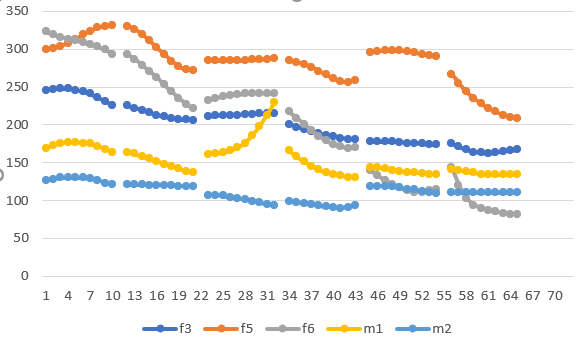</div>

# 相关工作
