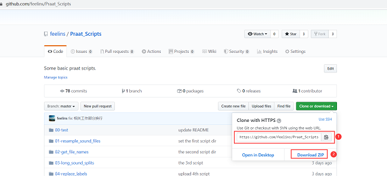

# Praat_Scripts Praat脚本

该项目包括一些`Praat`常用脚本，并结合简单实例说明如何使用这些脚本，每一个独立的目录里面有示例文件以及结果文件，适用于已经对`Praat`基本操作有些了解，对`时长`，`基频`，`共振峰`等基本声学参数有所了解的初学者。  

该项目包括以下内容：

1. `Praat`基本操作；
2. `Praat`对文件，包括标注文件`TextGrid`、音频文件`wav`的操作；
3. `Praat`对具体的标注信息的操作，比如`tier`, `interval`替换、增加、删除等操作；
4. 使用`Praat`提取主要的声学参数，`时长`，`基频`，`共振峰`；
5. 如何利用这些参数，作简单的声调、语调图；

希望能够对`Praat`入门的实验语音学初学者有所帮助，更多实用的`Praat脚本`持续更新中。  

# 如何使用github上Praat代码

[https://github.com/feelins/Praat_Scripts](https://github.com/feelins/Praat_Scripts)

如果日常对代码、脚本操作比较熟练的可通过下载、安装、配置`github for windows`在自己的电脑上通过`git clone`将代码下载到本机，并可以跟主站及时更新代码。如下图**1**位置所示。

如果对此操作并不熟悉，也可以通过点击上图**2**位置`Download ZIP`直接将本站所有代码下载，并解压，可直接使用。使用前请详细阅读本页每个脚本的说明。如果有任何错误、问题都可以通过脚本里的邮箱咨询。

# 目录  

* [背景](#背景)
* [安装](#安装)
* [Praat基本操作](#Praat基本操作)
    * [打开保存](#打开保存)
    * [脚本运行](#脚本运行)
* [Praat常用脚本](#常用操作)
    * [01-重采样音频文件](01-resample_sound_files/Resample_Sound_Files.Praat)
		* [CSDN详情阅读](https://blog.csdn.net/shaopengfei/article/details/108514990)
    * [02-获取目录内文件名](#02-获取目录内文件名)
    * [03-长音频文件切分](#03-长音频文件切分)
    * [04-替换标注内容](#04-替换标注内容)
    * [05-标注文件增加多层](#05-标注文件增加多层)
    * [06-标注文件修改某层](#06-标注文件修改某层)
    * [07-计算目录里音频总时长](#07-计算目录里音频总时长)
    * [08-提取某一层的时长](#08-提取某一层的时长)
    * [09-提取时长和基频](#09-提取时长和基频)
    * [10-提取时长和共振峰](#10-提取时长和共振峰)
    * [11-画元音分布图](#11-画元音分布图)
    * [12-画平行句语调图](#12-画平行句语调图)
	* [13-切除句子首尾静音段](#13-切除句子首尾静音段)
	* [14-删除选择区域内的所有边界](#14-删除选择区域内的所有边界)
	* [16-计算描述节奏的VC参数](#16-计算描述节奏的VC参数)
	* [17-拆分音素](#17-拆分音素)
	* [18-调整音量](#18-调整音量)
	* [19-双通道变单通道](#19-双通道变单通道)
	* [20-基本信息统计](20-stats_basic_infomation/Get_basic_infos.praat)
		* [CSDN原文阅读](https://blog.csdn.net/shaopengfei/article/details/108533610)
* [相关工作](#相关工作)
 

## 背景  

##### 命名  
>`Praat`在荷兰语中是说话或交谈的意思，而`doing phonetics by computer`即使用计算机研究语音学。作为软件的名称，简便起见，合起来翻译作`Praat语音学软件`。  

##### 作者  
>`Praat`的作者是荷兰阿姆斯特丹大学人文学院语音科学研究所的主席保罗·博尔斯马（*Paul Boersma*）教授和大卫·威宁克（*David Weenink*）助教授。  

##### 版本  
>`Praat`最早的版本发布于1993年。起初用户还无法自由地下载使用，但从2003年6月5日的4.1版起，作者取消了专门的授权并开放了绝大部分源代码。进一步，从2004年3月4日的4.2版起，作者开放了全部源代码，使`Praat`成为采用GNU通用公共许可证授权的开源软件。相隔短则一天，长则月余，作者就会发布最近修订的版本，消除旧的故障，增添新的功能。2007年12月10日发布了5.0版。  
>`Praat`目前支持在多种计算机平台上运行，包括：  
>* 作者为以上平台的用户提供已编译好的目标文件。高级用户还可以在其他操作系统平台上修改并编译源代码后运行`Praat`程序。
>* `Praat`能够在图形和命令行两种用户界面下运行，但两种界面的目标文件（可执行文件）各自独立，以`Windows`版为例，即分为`praat.exe`和`praatcon.exe`两个可执行文件，其中后者只能通过命令行方式从控制台调用。

该部分信息来源于[百度百科-Praat](https://baike.baidu.com/item/praat/7852897?fr=aladdin)。

## 安装  
`Praat`官方网站[http://www.fon.hum.uva.nl/praat/](http://www.fon.hum.uva.nl/praat/)，请根据自己的系统下载`Windows`, `Mac`, 或者`Linux`等版本，下载到本地电脑之后，双击打开**Praat.exe**就可以使用，无需安装。另外为了更好的体验`IPA`等特殊符号的标注，需要将安装页面的**Phonetic and international symbols**也一并安装，具体方法网站都有详细说明。请尽量使用最新版本。官方网站也提供了英文版的使用说明，以及很多脚本，但由于每个人完成实验的设计，目的等都不相同，所以很多脚本需要对`Praat`脚本的语法比较熟悉才能灵活使用。  

## Praat基本操作

#### 打开保存
1.  打开软件，双击已经下载的`Praat.exe`  

2. 点击`Open`, `Read from file...`，从弹出的对话框里找到要打开的标注文件(.TextGrid)或者音频文件(.wav)，再选择打开，这里可以选择多个文件同时打开

3. 在没有标注文件的时候，可以选择打开的音频文件，选择右侧的`Annotate`， `To TextGrid...`， 可以创建新的标注文件

4. 如图所示，我们创建两层，一层是`word`层，一层是`phoneme`层，此处命名可自定义

5. 这时，主窗口就会有一对同样名字的文件，一个是音频文件`Sound`，一个是标注文件`TextGrid`，同时选中这两个文件，再点右侧的`View & Edit`，这时会打开标注窗口，音频文件在上方，会显示声波图和频谱图，下方是标注区域，即是新建的`TextGrid`文件，并有两层`Word`和`Phoneme`层，先用鼠标找到合成的声音边界位置，再用鼠标点击如图位置的**小圆点**，则会增加一个**边界**，两个边界之间可以填写标注内容，如图前三个汉字部分

注: 示例所使用数据为[标贝开源女声数据](https://www.data-baker.com/open_source.html)

6. 每一句标注完成之后，回到主窗口，这时的标注文件并未自动保存，需要点击`Save`, `Save as text file...`，保存到相应的位置

7. 标注文件可以采用重复以上步骤二次打开，再次修改等操作，其它详细的操作，都可以参考社科院**熊子瑜老师的《Praat语音软件使用手册》**

#### 脚本运行

在掌握了`Praat`的基本操作之后，要知道如何运行一个脚本。  

1. 先打开`Praat`软件

2. 点击`Praat`, `Open praat script...`，

3. 找到需要打开的脚本，这里用简单的例子，[`00-test\test.Praat`](00-test\test.Praat)，这个脚本只有一句话，是在屏幕上打印`Hello World!`

4. 点击这个窗口的`Run`, `Run`

5. 脚本运行的结果是显示一句话，`Hello World!`，代表脚本运行成功

## 相关工作
1. [Praat官方网站](http://www.fon.hum.uva.nl/praat/)
2. [个人CSDN博客](https://blog.csdn.net/shaopengfei)
3. [部分数据来自，标贝开源女声数据](https://www.data-baker.com/open_source.html)
4. [部分数据来自](http://www.phon.ox.ac.uk/files/apps/IViE/)
