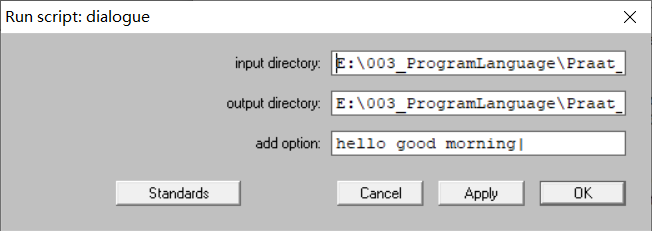
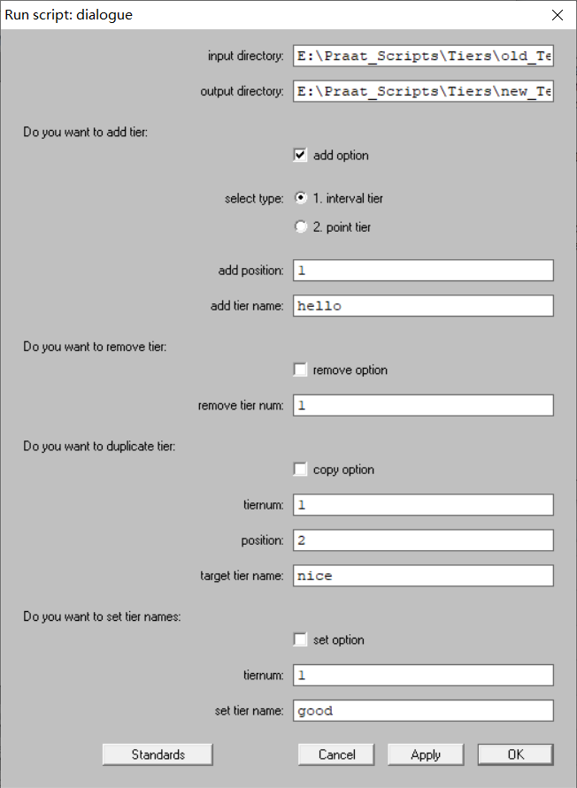

# Praat_Scripts - 层(Tier)操作
关于层的操作，提供以下脚本来批处理TextGrid的层，比如可以批量增加层，删除层，修改层的名称，以及将某一层复制一下，这些操作依赖于Praat的Tiers操作：  

> 第一个脚本`Tiers\add_tiers.Praat`：只增加，而且可以增加很多层，以及指定增加的层是否是interval或者point  

* 指定包括原始TextGrid的输入目录`input_directory`  
* 指定需要保存TextGrid的输出目录`output_directory`  
* 关于增加选项`add_option`的一些例子说明
    * `add_option: hello good morning`表示在原来TextGrid的最底部分别增加名称为hello, good, morning的三个层；
    * `add_option: hello good| morning`表示在原来TextGrid的最底部分别增加名称为hello, good, morning的三个层, 请注意`good`后面的`|`，表示这个层需要增加point层；
    * `add_option: 2(hello) good 1(morning|)`表示在原来TextGrid的第2层的位置增加名称为hello的interval层，在最底部增加名称为good的层, 在第1层的位置增加名称为morning的point层；

> 第二个脚本`Tiers\add_remove_duplicate_set_tier.Praat`：该脚本可以一次进行增加，删除，复制，修改层名称这四个操作，但是每一种操作一次只进行一层

* 指定包括原始TextGrid的输入目录`input_directory`  
* 指定需要保存TextGrid的输出目录`output_directory`  
* 需要增加层，选中`add_option`，以及选择interval或者point，其它选项参考Praat增加层的操作
* 需要删除层，选中`remove_option`, 只需提供删除第几层即可
* 需要复制层，选中`copy_option`，具体操作参考Praat复制层的操作
* 需要修改层的名称，选中`set_option`，具体操作参考Praat设置层名称的操作

